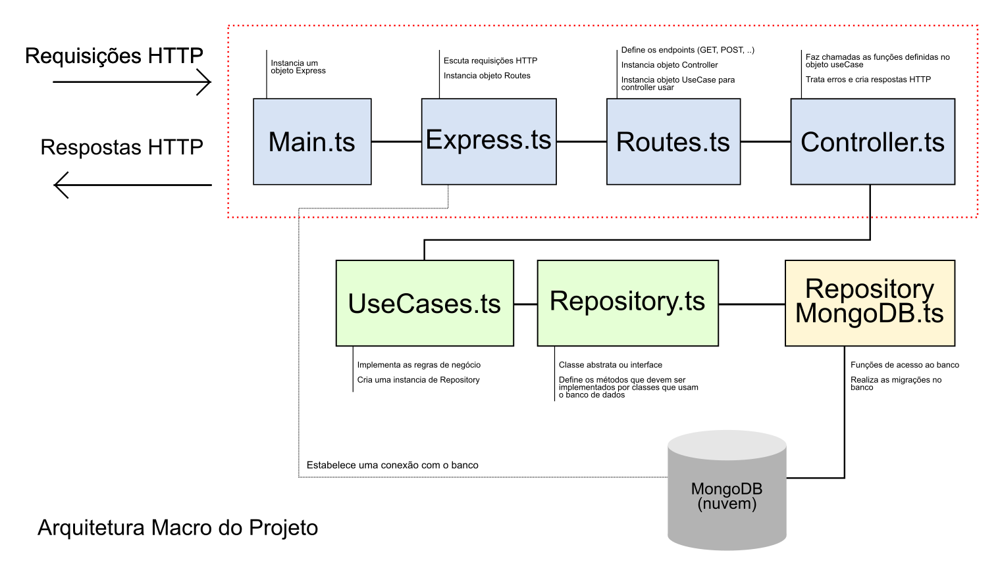

# Projeto Back-end Findbook (Node e MongoDB)

Esse projeto foi realizado em uma imersão da HeroPro como forma de passar conhecimentos em React, Node e MongoDB. O projeto foi simplificado, sendo implementado em typescript realizando operações de inclusão e pesquisa de livros em um banco mongoDB.

## Arquitetura do projeto

<!--  -->

## Link da imersão

Detalhes sobre a imersão [Semana do Herói [Edição 4]](https://herocodebr.notion.site/RoadMap-Semana-do-Her-i-Edi-o-4-7bf98455f83b46e6a808c66a37be405a)

## Pacotes utilizados

### Express

- **Descrição**: permite realizar/escutar requisições/respostas HTTP
- **Instalação**: npm install express

### Typescript e tipagem Express

- **Descrição**: permite trabalhar com a linguagem typescript e um módulo de tipos para o express
- **Instalação**:
  - npm i typescript @types/express -D
  - npx tsc --init
  - npm i tsx -D

> [!OBS]
> A flag **-D** indica que os pacotes serão instalados como dependência de desenvolvimento. Esses pacotes não sobem para a produção.

> [!OBS]
> O comando **npx tsc --init** inicializa configurações do Typescript para conversões em Javascript

> [!OBS]
> O comando **npm i tsx -D** permite executar o typescript no node.

### Zod

- **Descrição**: para validar campos de requisições e de tipos para inclusão em um banco por exemplo.
- **Instalação**: npm i zod

### MongoDB

- **Descrição**: permite a interação com o banco de dados mongoDB
- **Instalação**: npm i mongoose

### Dotenv

- **Descrição**: permite a utilização de variáveis de ambiente
- **Instalação**: npm i dotenv

### Cors e tipagem

- **Descrição**: permite receber requisições de diferentes fontes
- **Instalação**: npm i cors @type/cors
